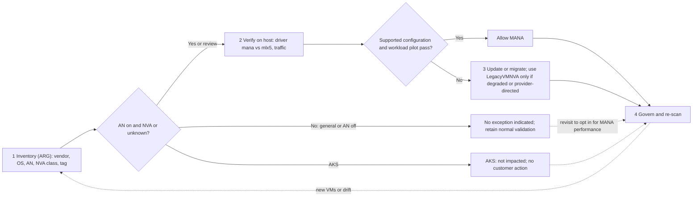
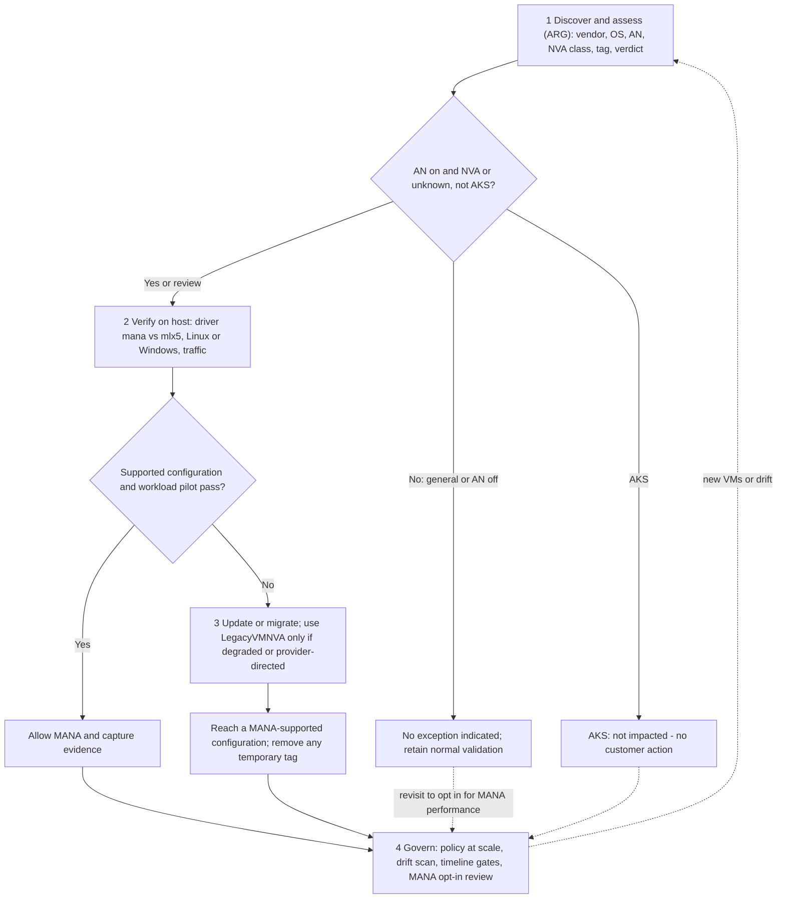

# Azure MANA + NVA Toolkit

**Assess, validate, and safely transition Network Virtual Appliance (NVA) workloads as Azure expands the Microsoft Azure Network Adapter (MANA) to existing VM series — with hands-on detection scripts, the `LegacyVMNVA` opt-out, and reproducible evidence.**

As Azure expands MANA (a component of Azure Boost) to existing VM series, VMs in eligible series may be placed on MANA-capable hardware. **Most workloads transition without issue**, but **NVAs need validation** because they depend directly on the underlying network hardware and drivers. This toolkit helps you check what your VMs are running on, apply the temporary `LegacyVMNVA` exception if needed, and plan migration.

> **Accuracy & sources:** every fact, date, tag, policy ID, and command is grounded in official Microsoft Learn (see [docs/references.md](./docs/references.md)). Re-verify dates against the live docs before relying on them.

## TL;DR

- Azure is expanding **MANA** (part of Azure Boost) to **existing** VM series. Eligible VMs may land on MANA-capable hardware after a **stop-deallocate-start** or a **maintenance event**.
- **Most workloads transition without issue.** Validate OS support and a representative baseline; NVAs need additional vendor and workload validation because they depend directly on the NIC hardware and drivers.
- Use the temporary **`LegacyVMNVA`** tag (honored to **May 31, 2027**) only for an AN-enabled NVA that observes degradation or when its provider directs the exception during migration.
- This toolkit runs the loop end-to-end: **inventory → verify on host → safeguard (if needed) → migrate**, with per-NIC reports and resumable evidence collection.

**Official refs:** [MANA overview](https://learn.microsoft.com/en-us/azure/virtual-network/accelerated-networking-mana-overview) · [existing VM series](https://learn.microsoft.com/en-us/azure/virtual-network/accelerated-networking-mana-existing-sizes) · [NVA opt-out (`LegacyVMNVA`)](https://learn.microsoft.com/en-us/azure/virtual-network/accelerated-networking-mana-network-virtual-appliance-opt-out).

## How it works



The classifier is **conservative by design**: only an image from a recognized OS publisher allow-list
(Microsoft, Canonical, Red Hat, SUSE, Debian, Oracle, and others) can resolve to `General`. Every Marketplace
plan, keyword hint, custom/unknown image, or publisher outside that allow-list is flagged for review. The
allow-list is a routing aid, not a claim of Microsoft ownership, MANA support, or workload readiness. Governance
model: [docs/governance.md](./docs/governance.md).

> **"No action" ≠ "ignore forever."** It means no `LegacyVMNVA` action is indicated by the inventory result. Keep supported-image, workload-baseline, and drift reviews in the **govern/re-scan loop**. General / AN-off VMs can later opt in to Accelerated Networking on a MANA-ready OS/series. Microsoft states that AKS instances are not impacted and continue to perform as expected on MANA hardware.

### Governance process (in depth)

For customers and reviewers who want the full decision path — discover, verify, allow-or-safeguard, migrate, then govern at scale in a continuous loop:



Full continuous-governance model (scale enforcement, drift, vendor register, RACI, timeline gates): [docs/governance.md](./docs/governance.md).

## Prerequisites

- **Azure CLI** signed in: `az login`; then `az account set --subscription <subscription-id>`.
- **Resource Graph extension** (for inventory queries): `az extension add -n resource-graph`.
- **PowerShell 5.1+** for the resumable fleet runner.
- **Permissions:** Reader for inventory; **Virtual Machine Contributor** to run `az vm run-command`; **Resource Policy Contributor** (plus a role for the policy's managed identity) to assign/remediate the opt-out policy.
- In-guest checks run via `az vm run-command` — **no public IP or inbound SSH required**.

## Step 1 — Find candidates at scale (Azure Resource Graph)

```bash
az extension add -n resource-graph            # one-time
az graph query -q "@scripts/inventory-nva-vms.kql" --first 1000 \
  --query "data[].{Sub:subscriptionId, RG:resourceGroup, VM:VMName, Vendor:Vendor, NVA:NVAClass, ImageSource:ImageSource, OS:OSType, OSVersion:OSVersion, Size:VMSize, AN:AcceleratedNetworking, Tag:LegacyVMNVATag, Verdict:Assessment}" \
  -o table
```

One row **per VM** (multi-NIC safe) with the identity to drive Step 2 (**Sub + RG + VM**), **Vendor** (Marketplace plan-publisher aware), **NVAClass** (publisher-listed/product-unverified / marketplace-unlisted / keyword-hint / custom-unknown / **third-party-publisher** / general), **ImageSource**, **OS + OSVersion** (drives `.sh` vs `.ps1`), NIC-accurate **AN**, the **tag**, and a **verdict**. Also run [scripts/inventory-nva-vmss.kql](./scripts/inventory-nva-vmss.kql) (scale sets, AKS-aware) and [scripts/discover-vendors.kql](./scripts/discover-vendors.kql) to **enumerate every vendor / plan / OS so no vendor is skipped**. Details: [docs/inventory-arg.md](./docs/inventory-arg.md).

For one row **per attached NIC**, use [scripts/inventory-mana-nics.kql](./scripts/inventory-mana-nics.kql). For
more than 1,000 rows or durable reports, use the runner; it follows ARG continuation tokens, retries transient
failures, checkpoints every VM, and preserves `UNKNOWN` states:

```powershell
pwsh ./scripts/invoke-mana-fleet-assessment.ps1 `
  -SubscriptionId <subscription-id> `
  -OutputDirectory ./mana-assessment-output
```

See [docs/fleet-assessment.md](./docs/fleet-assessment.md) for inventory-only, resume, redaction, outputs, and
the status contract.

> The KQL selects more columns than any one `--query` shows (`PlanPublisher`, `PlanProduct`, `Offer`, `Sku`, `location`). The `--query` is a **client-side filter** — Resource Graph Explorer shows all fields.
> ARG shows candidates only — it **cannot** confirm MANA hardware, nor that a tag was enabled via reapply. Do that in Step 2.

## Step 2 — Is a given VM on MANA? (driver + traffic — the durable check)

The **`LegacyVMNVA` tag is a temporary workaround** (honored only to May 31, 2027). The **durable signal is on the host**: which driver is bound to the accelerated VF (`mana` vs `mlx5_core`) and whether traffic actually flows over it. Use the Sub + RG + VM from Step 1 to target each VM directly.

**Pick the script by the `OS` column from Step 1** — the scripts are OS-specific because they call OS-native tools (`lspci`/`ethtool` on Linux; `Get-NetAdapter`/`Get-PnpDevice` on Windows):

| OS (from Step 1) | `--command-id`        | Scripts to use                                                                  |
| ---------------- | --------------------- | ------------------------------------------------------------------------------- |
| **Linux**        | `RunShellScript`      | `detect-mana.sh`, `validate-nva-mana.sh`, `distinguish-vf-mana.sh` (`.sh` only) |
| **Windows**      | `RunPowerShellScript` | `detect-mana.ps1`, `validate-nva-mana.ps1` (`.ps1` only)                        |

So yes — **`.sh` runs on Linux exclusively, `.ps1` on Windows exclusively.** Running the wrong one fails (the tools don't exist on the other OS). Appliance OSes (PAN-OS, FortiOS, etc.) run neither — use the vendor matrix.

```bash
az account set --subscription <Sub>          # from Step 1
# Linux quick check (driver + lspci + VF counters):
az vm run-command invoke -g <RG> -n <VM> --command-id RunShellScript \
  --scripts @scripts/detect-mana.sh --query "value[0].message" -o tsv
```

For a full per-VM verdict (tag + MANA hardware + driver + datapath evidence), use the **validator**; to attribute live traffic under load to a NIC family, use the **distinguisher**:

```bash
# Full validator (Linux)
az vm run-command invoke -g <RG> -n <VM> --command-id RunShellScript \
  --scripts @scripts/validate-nva-mana.sh --query "value[0].message" -o tsv

# Attribute live traffic to MANA vs Mellanox (flood-ping a second VM's private IP)
az vm run-command invoke -g <RG> -n <VM> --command-id RunShellScript \
  --scripts @scripts/distinguish-vf-mana.sh --parameters "<target-private-ip>" --query "value[0].message" -o tsv
```

**Windows** uses `RunPowerShellScript` + [scripts/detect-mana.ps1](./scripts/detect-mana.ps1) (quick) or [scripts/validate-nva-mana.ps1](./scripts/validate-nva-mana.ps1) (full):

```bash
az vm run-command invoke -g <RG> -n <VM> --command-id RunPowerShellScript \
  --scripts @scripts/validate-nva-mana.ps1 --query "value[0].message" -o tsv
```

Read the result:

| VF driver (`ethtool -i <vf>`) | `lspci`                 | Meaning         |
| ----------------------------- | ----------------------- | --------------- |
| `mana`                        | `Device 00ba`           | **On MANA**     |
| `mlx5_core`                   | `Mellanox … ConnectX-5` | **Not on MANA** |

The netvsc log line `hv_netvsc … eth0: Data path switched to VF: <name>` identifies the VF selected by netvsc (`sudo dmesg | grep "Data path switched"`). Increasing `vf_*` counters show use of an accelerated VF but are identical on MANA and Mellanox; identify the NIC family from the bound VF driver and PCI device. Captured and expected examples: [docs/sample-outputs.md](./docs/sample-outputs.md).

> Hardware, driver, and datapath evidence do not certify custom-image behavior or NVA vendor support. Treat those as separate approval gates.

> **Third-party appliances (Cisco, Palo Alto, Fortinet, Check Point, F5):** their OS has no standard shell, so `lspci`/`ethtool` won't run. Validate via the vendor's MANA/Accelerated Networking compatibility matrix + a support case, and the appliance's own CLI. See [docs/inventory-arg.md](./docs/inventory-arg.md#third-party-nvas-cisco-palo-alto-etc--non-windowslinux-images).

## What's inside

| Path                                                                       | Purpose                                                                            |
| -------------------------------------------------------------------------- | ---------------------------------------------------------------------------------- |
| [docs/facts-and-timeline.md](./docs/facts-and-timeline.md)                 | What MANA is, eligible VM series, placement dates, `LegacyVMNVA`, ODCR             |
| [docs/mana-explained-and-demo.md](./docs/mana-explained-and-demo.md)       | Teach/show guide: highway analogy, scripts (what/when/why), evidence walkthrough   |
| [docs/faq.md](./docs/faq.md)                                               | FAQ: AN-disabled action, tag mechanism/dates, non-Marketplace NVAs, ODCR, v6+      |
| [docs/inventory-arg.md](./docs/inventory-arg.md)                           | Inventory NVA candidates at scale with Azure Resource Graph (multi-NIC safe)       |
| [docs/fleet-assessment.md](./docs/fleet-assessment.md)                     | Resumable per-NIC assessment, status schema, reports, and failure handling         |
| [docs/verify-mana-nic.md](./docs/verify-mana-nic.md)                       | Verify MANA (Portal, Linux, Windows) — direct hardware, driver, and traffic checks |
| [docs/implementation-legacyvmnva.md](./docs/implementation-legacyvmnva.md) | Apply the opt-out (policy → remediate → reapply → verify → roll back), az CLI      |
| [docs/governance.md](./docs/governance.md)                                 | Continuous governance: scale enforcement, drift, vendor register, RACI, gates      |
| [docs/evidence-lab.md](./docs/evidence-lab.md)                             | Reproducible MVP lab: deploy, detect, capture traffic, compare MANA vs not         |
| [docs/sample-outputs.md](./docs/sample-outputs.md)                         | Real (anonymized) script/query outputs: Linux, Windows, traffic, ARG               |
| [docs/references.md](./docs/references.md)                                 | Public Microsoft references + verified key values                                  |

**Scripts** (`scripts/`) — run in-guest via `az vm run-command` (no SSH/RDP), or the `.kql` in Resource Graph Explorer:

- **Inventory:** [`inventory-nva-vms.kql`](./scripts/inventory-nva-vms.kql), [`inventory-nva-vmss.kql`](./scripts/inventory-nva-vmss.kql), [`inventory-mana-nics.kql`](./scripts/inventory-mana-nics.kql) — VM, VMSS, and per-NIC control-plane views.
- **Fleet runner:** [`invoke-mana-fleet-assessment.ps1`](./scripts/invoke-mana-fleet-assessment.ps1) — pagination, retries, checkpoint/resume, JSON/CSV, partial failures, and optional report redaction.
- **Discovery:** [`discover-vendors.kql`](./scripts/discover-vendors.kql) — enumerate **every** vendor / plan / OS so no vendor is missed.
- **Quick detect:** [`detect-mana.sh`](./scripts/detect-mana.sh), [`detect-mana.ps1`](./scripts/detect-mana.ps1) — driver + `lspci` + VF counters.
- **Full validator:** [`validate-nva-mana.sh`](./scripts/validate-nva-mana.sh), [`validate-nva-mana.ps1`](./scripts/validate-nva-mana.ps1) — tag + hardware + driver + netvsc datapath + functioning + verdict.
- **Traffic:** [`distinguish-vf-mana.sh`](./scripts/distinguish-vf-mana.sh) (MANA vs Mellanox under load) · [`traffic-capture.sh`](./scripts/traffic-capture.sh) (VF counters before/after).

## Recommended actions (summary)

1. Identify NVA workloads on MANA-eligible VM series; read Accelerated Networking state from each Azure NIC resource.
2. Confirm MANA compatibility with your NVA vendor (VM series, OS, drivers, image version).
3. If compatibility is uncertain, run a representative pilot and plan the required OS, image, appliance, or VM-series update.
4. Use `LegacyVMNVA` only after observed degradation or provider direction. For existing resources, add the tag and **reapply** to enable it. See [when / why / how / when-not](./docs/implementation-legacyvmnva.md#when-to-use--when-not-to-use).
5. Roll out gradually with safe-deployment practices; validate app + network behavior.
6. Migrate to a MANA-compatible configuration and remove the exception when compatibility is confirmed.

**Key dates:** earliest MANA placement (public cloud) — **May 26, 2026** for Intel v5 + Cobalt 100 v6. Other eligible series (incl. **Dsv2/Dv2/Bsv2/Av2, Dsv3/Dsv4, Fsv2, Ls**) are currently **"Timeline under review"** — no confirmed date. The `LegacyVMNVA` tag is honored **until May 31, 2027**. See [docs/facts-and-timeline.md](./docs/facts-and-timeline.md).

## Important notes

- **Placement is Azure-controlled for eligible existing series** — they may run on Mellanox or MANA hardware. Microsoft documents Intel v6 or later as MANA-based; verify the exact target series and guest support.
- **`LegacyVMNVA` is a situational safeguard, not a compatibility test.** Use it for an AN-enabled NVA that observes degradation or when the provider directs it; do not apply it merely because compatibility is unknown. Details: [implementation-legacyvmnva.md](./docs/implementation-legacyvmnva.md#when-to-use--when-not-to-use).
- The built-in policy matches only **specific Marketplace publisher/product combinations**. Verify the live policy definition; for NVAs acquired outside Marketplace or via a managed service, coordinate tag deployment with the vendor/MSP.

## License

[Apache-2.0](./LICENSE).

> This toolkit is provided as-is for guidance. Confirm all behavior against official Microsoft documentation for your environment before production use.
