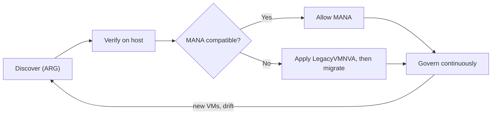
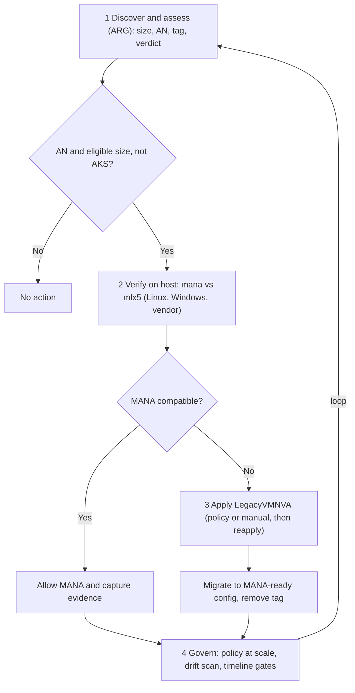

# Azure MANA + NVA Toolkit

**Assess, validate, and safely transition Network Virtual Appliance (NVA) workloads as Azure expands the Microsoft Azure Network Adapter (MANA) to existing VM series — with hands-on detection scripts, the `LegacyVMNVA` opt-out, and reproducible evidence.**

As Azure expands MANA (a component of Azure Boost) to existing VM series, VMs in eligible series may be placed on MANA-capable hardware. **Most workloads transition without issue**, but **NVAs need validation** because they depend directly on the underlying network hardware and drivers. This toolkit helps you check what your VMs are running on, apply the temporary `LegacyVMNVA` exception if needed, and plan migration.

> ⚠️ **Accuracy & sources:** Every fact, date, tag, policy ID, and command is grounded in official Microsoft Learn pages listed in [docs/references.md](./docs/references.md). Verified 2026-08-03; re-verify dates against the live docs before relying on them.

## What is MANA, and why it matters

The **Microsoft Azure Network Adapter (MANA)** is Azure's next-generation network interface and a component of **Azure Boost**. It provides stable, **forward-compatible** drivers for Windows and Linux, engineered by Microsoft to take advantage of the latest cloud-networking hardware. Azure is expanding MANA from newer VM series to **existing** series, so eligible VMs may be placed on MANA-capable hardware over time.

**Benefits / value add:**

- **Performance & scalability** — higher throughput and better handling of large connection counts on modern hardware.
- **Reliability & resiliency** — improvements delivered at the platform layer.
- **Forward-compatible drivers** — a stable driver model reduces future churn; feature parity with prior Azure networking is maintained (Mellanox `mlx4`/`mlx5` still supported).
- **No action for most workloads** — standard VMs transition transparently.

**Business impact for NVAs:** Network Virtual Appliances (firewalls, routers, SD-WAN) depend directly on the NIC hardware/driver, so a placement change can affect throughput or connectivity if the appliance isn't MANA-compatible. This toolkit lets you **inventory, validate, and de-risk** that transition — and use the Microsoft-provided **`LegacyVMNVA`** temporary exception to defer MANA placement (until **May 31, 2027**) while you confirm vendor compatibility and migrate. The result: **no surprise outages, a defensible audit trail, and a planned migration** instead of a reactive one.

**Official references:** [MANA overview](https://learn.microsoft.com/en-us/azure/virtual-network/accelerated-networking-mana-overview) · [MANA for existing VM series](https://learn.microsoft.com/en-us/azure/virtual-network/accelerated-networking-mana-existing-sizes) · [MANA support for NVAs (`LegacyVMNVA`)](https://learn.microsoft.com/en-us/azure/virtual-network/accelerated-networking-mana-network-virtual-appliance-opt-out) · full list in [docs/references.md](./docs/references.md).

## Workflow

1. **Inventory** candidates at scale (Azure Resource Graph) → find VMs with Accelerated Networking on eligible sizes.
2. **Verify** each candidate in-guest → is it actually on MANA? (`mana` vs `mlx5_core`).
3. **Safeguard (if needed)** — for any NVA **not confirmed MANA-compatible**, apply the `LegacyVMNVA` opt-out **proactively** (don't wait for a performance hit).
4. **Migrate** to a MANA-compatible config, then remove the exception.

### High-level process



### In-depth technical process



See [docs/governance.md](./docs/governance.md) for the continuous-governance model.

## Prerequisites

- **Azure CLI** signed in: `az login`; then `az account set --subscription <subscription-id>`.
- **Resource Graph extension** (for inventory queries): `az extension add -n resource-graph`.
- **Permissions:** Reader for inventory; **Virtual Machine Contributor** to run `az vm run-command`; **Resource Policy Contributor** (plus a role for the policy's managed identity) to assign/remediate the opt-out policy.
- In-guest checks run via `az vm run-command` — **no public IP or inbound SSH required**.

## Step 1 — Find candidates at scale (Azure Resource Graph)

```bash
az extension add -n resource-graph            # one-time
az graph query -q "@scripts/inventory-nva-vms.kql" --first 1000 \
  --query "data[].{Sub:subscriptionId, RG:resourceGroup, VM:VMName, Vendor:Vendor, Size:VMSize, OS:OSType, NICs:NICCount, AN:AcceleratedNetworking, Tag:LegacyVMNVATag, Verdict:Assessment}" \
  -o table
```

Returns one row **per VM** (multi-NIC safe) with **Subscription + resource group + VM name** (the identity you feed straight into Step 2), **Vendor** (image publisher), size, **OS** (`Linux`/`Windows` — tells you whether to run the `.sh` or `.ps1` in Step 2), NIC-accurate AN, the **`LegacyVMNVA` tag**, and a **triage verdict**. Also run [scripts/inventory-nva-vmss.kql](./scripts/inventory-nva-vmss.kql) for **scale sets** (AKS-aware). Details + the multiple-NIC fix: [docs/inventory-arg.md](./docs/inventory-arg.md). Both queries also run in **Azure Resource Graph Explorer** in the portal.

> The KQL selects more columns than any one `--query` shows (Offer, Sku for OS version, location, etc.). The `--query` projection above is a **client-side filter** — in Resource Graph Explorer you'll see all fields; add/remove fields in `--query` to widen or narrow the CLI table.
> ARG shows candidates only — it **cannot** confirm MANA hardware, nor that a tag was enabled via reapply. Do that in Step 2.

## Step 2 — Is a given VM on MANA? (driver + traffic — the durable check)

The **`LegacyVMNVA` tag is a temporary workaround** (honored only to May 31, 2027). The **durable signal is on the host**: which driver is bound to the accelerated VF (`mana` vs `mlx5_core`) and whether traffic actually flows over it. Use the Sub + RG + VM from Step 1 to target each VM directly.

**Pick the script by the `OS` column from Step 1** — the scripts are OS-specific because they call OS-native tools (`lspci`/`ethtool` on Linux; `Get-NetAdapter`/`Get-PnpDevice` on Windows):

| OS (from Step 1) | `--command-id`        | Scripts to use                                                                  |
| ---------------- | --------------------- | ------------------------------------------------------------------------------- |
| **Linux**        | `RunShellScript`      | `detect-mana.sh`, `validate-nva-mana.sh`, `distinguish-vf-mana.sh` (`.sh` only) |
| **Windows**      | `RunPowerShellScript` | `detect-mana.ps1`, `validate-nva-mana.ps1` (`.ps1` only)                        |

So yes — **`.sh` runs on Linux exclusively, `.ps1` on Windows exclusively.** Running the wrong one fails (the tools don't exist on the other OS). Appliance OSes (PAN-OS, FortiOS, etc.) run neither — use the vendor matrix.

```bash
az account set --subscription <Sub>          # from Step 1
# Linux quick check (driver + lspci + VF counters):
az vm run-command invoke -g <RG> -n <VM> --command-id RunShellScript \
  --scripts @scripts/detect-mana.sh --query "value[0].message" -o tsv
```

For a full per-VM verdict (tag + MANA hardware + driver + authoritative netvsc datapath + VF functioning), use the **validator**; to prove _which_ NIC carried live traffic under load, use the **distinguisher**:

```bash
# Full validator (Linux)
az vm run-command invoke -g <RG> -n <VM> --command-id RunShellScript \
  --scripts @scripts/validate-nva-mana.sh --query "value[0].message" -o tsv

# Attribute live traffic to MANA vs Mellanox (flood-ping a second VM's private IP)
az vm run-command invoke -g <RG> -n <VM> --command-id RunShellScript \
  --scripts @scripts/distinguish-vf-mana.sh --parameters "<target-private-ip>" --query "value[0].message" -o tsv
```

**Windows** uses `RunPowerShellScript` + [scripts/detect-mana.ps1](./scripts/detect-mana.ps1) (quick) or [scripts/validate-nva-mana.ps1](./scripts/validate-nva-mana.ps1) (full):

```bash
az vm run-command invoke -g <RG> -n <VM> --command-id RunPowerShellScript \
  --scripts @scripts/validate-nva-mana.ps1 --query "value[0].message" -o tsv
```

Read the result:

| VF driver (`ethtool -i <vf>`) | `lspci`                 | Meaning         |
| ----------------------------- | ----------------------- | --------------- |
| `mana`                        | `Device 00ba`           | **On MANA**     |
| `mlx5_core`                   | `Mellanox … ConnectX-5` | **Not on MANA** |

The **authoritative** "which VF carries traffic" signal is the netvsc log line `hv_netvsc … eth0: Data path switched to VF: <name>` (`sudo dmesg | grep "Data path switched"`). The `vf_*` counters prove traffic is _accelerated_ but are identical on MANA and Mellanox — attribute to MANA via the driver/`dmesg`. Real outputs (Linux + Windows, MANA vs not, traffic before/after): [docs/sample-outputs.md](./docs/sample-outputs.md).

> **Third-party appliances (Cisco, Palo Alto, Fortinet, Check Point, F5):** their OS has no standard shell, so `lspci`/`ethtool` won't run. Validate via the vendor's MANA/Accelerated Networking compatibility matrix + a support case, and the appliance's own CLI. See [docs/inventory-arg.md](./docs/inventory-arg.md#third-party-nvas-cisco-palo-alto-etc--non-windowslinux-images).

## What's inside

| Path                                                                       | Purpose                                                                       |
| -------------------------------------------------------------------------- | ----------------------------------------------------------------------------- |
| [docs/facts-and-timeline.md](./docs/facts-and-timeline.md)                 | What MANA is, eligible VM series, placement dates, `LegacyVMNVA`, ODCR        |
| [docs/inventory-arg.md](./docs/inventory-arg.md)                           | Inventory NVA candidates at scale with Azure Resource Graph (multi-NIC safe)  |
| [docs/verify-mana-nic.md](./docs/verify-mana-nic.md)                       | Verify MANA (Portal, Linux, Windows) — the definitive checks                  |
| [docs/implementation-legacyvmnva.md](./docs/implementation-legacyvmnva.md) | Apply the opt-out (policy → remediate → reapply → verify → roll back), az CLI |
| [docs/governance.md](./docs/governance.md)                                 | Continuous governance: scale enforcement, drift, vendor register, RACI, gates |
| [docs/evidence-lab.md](./docs/evidence-lab.md)                             | Reproducible MVP lab: deploy, detect, capture traffic, compare MANA vs not    |
| [docs/sample-outputs.md](./docs/sample-outputs.md)                         | Real (anonymized) script/query outputs: Linux, Windows, traffic, ARG          |
| [docs/references.md](./docs/references.md)                                 | Public Microsoft references + verified key values                             |

**Scripts** (`scripts/`) — run in-guest or remotely via `az vm run-command` (no SSH/RDP):

- **Inventory:** [`inventory-nva-vms.kql`](./scripts/inventory-nva-vms.kql), [`inventory-nva-vmss.kql`](./scripts/inventory-nva-vmss.kql) — candidates at scale (Sub + RG + VM per row).
- **Quick detect:** [`detect-mana.sh`](./scripts/detect-mana.sh), [`detect-mana.ps1`](./scripts/detect-mana.ps1) — driver + `lspci` + VF counters.
- **Full validator:** [`validate-nva-mana.sh`](./scripts/validate-nva-mana.sh), [`validate-nva-mana.ps1`](./scripts/validate-nva-mana.ps1) — tag + hardware + driver + netvsc datapath + functioning + verdict.
- **Traffic attribution:** [`distinguish-vf-mana.sh`](./scripts/distinguish-vf-mana.sh) — proves MANA vs Mellanox under load (dmesg / IRQ / per-VF bytes).
- **Traffic capture:** [`traffic-capture.sh`](./scripts/traffic-capture.sh) — VF counters before/after a flood ping.
  | [scripts/inventory-nva-vms.kql](./scripts/inventory-nva-vms.kql) | Azure Resource Graph query — per-VM NIC + Accelerated Networking inventory |
  | [scripts/inventory-nva-vmss.kql](./scripts/inventory-nva-vmss.kql) | Azure Resource Graph query — VMSS inventory (AKS-aware, AN + tag + verdict) |
  | [scripts/detect-mana.sh](./scripts/detect-mana.sh) | Detect MANA vs ConnectX on **Linux** (kernel, `lspci`, VF driver, counters) |
  | [scripts/detect-mana.ps1](./scripts/detect-mana.ps1) | Detect MANA on **Windows** (`Get-NetAdapter`, `Get-PnpDevice`, stats) |
  | [scripts/traffic-capture.sh](./scripts/traffic-capture.sh) | VF counter before/after a VM-to-VM flood ping |

## Recommended actions (summary)

1. Identify NVA workloads on MANA-eligible VM series; confirm whether Accelerated Networking is enabled. If not enabled, no action is required.
2. Confirm MANA compatibility with your NVA vendor (VM series, OS, drivers, image version).
3. **If an NVA is not confirmed MANA-compatible, apply the `LegacyVMNVA` opt-out proactively — don't wait for a performance hit** (which can be severe and cause an outage). It keeps the NVA off MANA hardware until you validate compatibility and migrate. See [when / why / how / when-not](./docs/implementation-legacyvmnva.md#when-to-use--when-not-to-use).
4. Assign the built-in `LegacyVMNVA` Azure Policy; for existing resources, remediate to add the tag, then **reapply** to enable it. New in-scope deployments get the tag automatically.
5. Roll out gradually with safe-deployment practices; validate app + network behavior.
6. Migrate to a MANA-compatible configuration and remove the exception when compatibility is confirmed.

**Key dates:** earliest MANA placement — **May 26, 2026** (Cobalt 100 & Intel v5, public cloud) and **August 6, 2026** (Intel v1–v4, public cloud). The `LegacyVMNVA` tag is honored **until May 31, 2027**. See [docs/facts-and-timeline.md](./docs/facts-and-timeline.md).

## Important notes

- **Placement is Azure-controlled** — you cannot force a VM onto MANA. Newer (v6) sizes are far more likely to land on MANA.
- **`LegacyVMNVA` is a situational safeguard, not the goal** — a documented process for **when / why / how (and when not)** to defer MANA placement. Apply it **proactively** to NVAs not yet confirmed MANA-compatible; **don't** apply it broadly, to MANA-compatible workloads, to AN-disabled VMs, or to AKS pools. Details: [implementation-legacyvmnva.md](./docs/implementation-legacyvmnva.md#when-to-use--when-not-to-use).
- The built-in policy auto-tags only **Marketplace NVA** images. For NVAs acquired outside Marketplace or via a managed service, coordinate tag deployment with the vendor/MSP.

## License

[Apache-2.0](./LICENSE).

> This toolkit is provided as-is for guidance. Confirm all behavior against official Microsoft documentation for your environment before production use.
