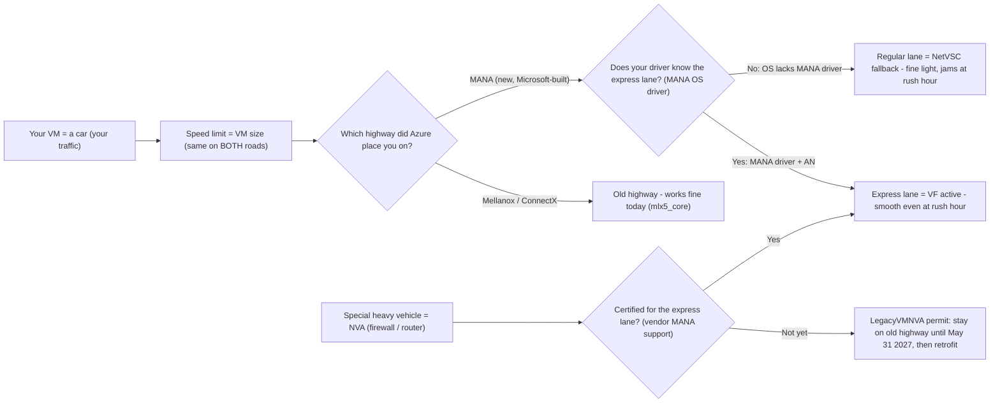
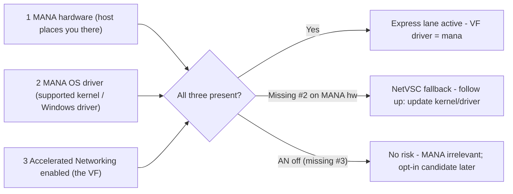

# MANA Explained + Evidence Walkthrough

A single place to **explain what MANA is** (with a plain-English analogy), then **demonstrate it** with exact,
real script/query outputs for every case: on MANA, not on MANA, driver missing, hardware missing, traffic
attribution, AN disabled, and NVA tagging. Use it to teach the change, the scripts, and the lifecycle.

> Everything here is grounded in official Microsoft Learn ([references.md](./references.md)). Verified 2026-09-03.
> Captured and expected-output examples are clearly labeled in [sample-outputs.md](./sample-outputs.md); the reproducible lab is [evidence-lab.md](./evidence-lab.md).

---

## 1. The analogy — MANA is a new highway, not a faster car

The most common misconception is _"MANA makes my network faster."_ It doesn't raise your speed limit.

- **Your VM is a car**, and your network traffic is the cars on the road.
- **The speed limit is your VM size** — Azure ties network bandwidth caps to the **VM size, not the hardware**.
  Moving to MANA does **not** raise that limit. A bigger car (bigger VM) still has the higher limit on either road.
- **Mellanox / ConnectX is the old highway.** It works fine today.
- **MANA is a newly engineered highway** (new **hardware**) with a smoother **express lane** and better on-ramps,
  built by Microsoft, shipped with **forward-compatible drivers** (new **software**).
- **The express lane is Accelerated Networking (the SR-IOV Virtual Function / VF).** To drive it, your car needs a
  **driver who knows the express lane — the MANA OS driver** (a supported Linux kernel or the Windows MANA driver).
- If your driver **doesn't** know the new express lane (OS lacks MANA support), you fall back to the **regular lane
  (NetVSC / the hypervisor virtual switch)**. Fine when traffic is light; it **jams at rush hour** (many concurrent
  connections).
- **The payoff isn't top speed — it's rush hour.** The new highway handles **high connection counts** better and is
  more **reliable and resilient**, with drivers that won't need replacing every year.
- **NVAs are special heavy vehicles** (armored trucks / inspection booths = firewalls, routers, SD-WAN). They're
  **bolted tightly to the road hardware and drivers**, so if their driver isn't certified for the new express lane
  they can **stall or slow the whole lane** — which is why they need validation before MANA.
- **The `LegacyVMNVA` tag is a "stay on the old highway" permit** for those special vehicles — it keeps them on the
  familiar Mellanox road **until May 31, 2027** while you retrofit them (update the driver / move to a MANA-ready vehicle).
- **AKS is outside this customer-action lane** — Microsoft states that AKS instances are not impacted and continue
  to perform as expected on MANA hardware.



### Analogy → Azure reality → what to check

| Analogy                      | Azure reality                                             | How you see it (this toolkit)                                   |
| ---------------------------- | --------------------------------------------------------- | --------------------------------------------------------------- |
| The car                      | Your VM / workload                                        | ARG inventory (`inventory-nva-*.kql`)                           |
| Speed limit                  | Bandwidth cap **tied to VM size**, not the road           | Docs fact; unchanged by MANA placement                          |
| Old highway                  | Mellanox / ConnectX host + `mlx5_core` VF driver          | `lspci` = ConnectX; VF driver `mlx5_core`                       |
| New highway (hardware)       | MANA-capable host                                         | `lspci` = `Device 00ba` (Linux) / `VEN_1414&DEV_00BA` (Windows) |
| Express lane                 | Accelerated Networking = SR-IOV **Virtual Function (VF)** | A `CHILD`, or legacy `SLAVE`, associated with a NetVSC adapter  |
| Driver who knows the lane    | **MANA OS driver** (Linux kernel / Windows driver)        | VF driver `mana` / adapter "Microsoft Azure Network Adapter"    |
| Regular lane (fallback)      | **NetVSC** (hypervisor vSwitch) when OS lacks MANA        | On MANA hw but VF driver ≠ `mana` → NetVSC fallback             |
| Rush hour                    | **High concurrent connection counts**                     | Where MANA's reliability/scale benefit shows                    |
| Special heavy vehicle        | **NVA** (firewall / router / SD-WAN)                      | `NVAClass` in ARG; validate on host or via vendor               |
| "Stay on old highway" permit | **`LegacyVMNVA`** opt-out tag (honored to May 31, 2027)   | Tag + `reapply`; ARG `LegacyVMNVATag` column                    |
| Outside this action lane     | **AKS** (Microsoft states instances aren't impacted)      | Excluded → "AKS-managed - not impacted"                         |

---

## 2. What MANA actually is (grounded)

- **MANA = Microsoft Azure Network Adapter**, a **component of Azure Boost**. A **next-generation network interface**
  with **stable, forward-compatible drivers** for Windows and Linux; **hardware and software both engineered by
  Microsoft**. ([overview](https://learn.microsoft.com/en-us/azure/virtual-network/accelerated-networking-mana-overview))
- **It's not a bandwidth upgrade.** _"Networking limits in Azure are tied to the VM size, not the underlying hardware.
  No change in performance is expected when moving to MANA-capable hardware if your VM's OS supports all network
  devices."_ ([existing-sizes](https://learn.microsoft.com/en-us/azure/virtual-network/accelerated-networking-mana-existing-sizes))
- **The value:** performance **at scale** (high connection counts), **reliability**, **resiliency**, and
  **forward-compatible drivers** that reduce future churn.
- **Feature parity is maintained.** MANA-eligible VMs run on hosts with **both** Mellanox and MANA NICs, so existing
  `mlx4` / `mlx5` support must still be present.
- **If the OS doesn't support MANA**, networking **falls back to NetVSC** (the hypervisor virtual switch). The VF may
  be visible but exposes no interfaces; performance is comparable to `ConnectX-3/4 Lx/5`, and **workloads with many
  concurrent connections may see reduced performance**.
- **If Accelerated Networking is disabled**, Microsoft states that **no action is required**. Classify AN from the
  Azure NIC resource; guest PCI/VF visibility does not override that control-plane setting.

### The three things that must line up

MANA acceleration needs **all three**. Miss one and you land in the fallback lane (or MANA is simply irrelevant):



---

## 3. Lifecycle + tagging — what / when / why / when-not

The end-to-end loop (inventory → verify → safeguard-if-needed → migrate → govern) and the two tracks (risk vs
MANA-optimization opt-in) are drawn in the [README](../README.md#how-it-works) and detailed in
[governance.md](./governance.md). The tag mechanics:

| Question            | Answer                                                                                                                                                                                                                               |
| ------------------- | ------------------------------------------------------------------------------------------------------------------------------------------------------------------------------------------------------------------------------------ |
| **What** is the tag | `LegacyVMNVA` — applied by a **built-in Azure Policy** (`e87a87f5-e6dd-4919-be21-abb0a4ea4630`, v1.3.0)                                                                                                                              |
| **What** it does    | Keeps tagged NVA VMs / VMSS **off** MANA-capable hardware while you migrate                                                                                                                                                          |
| **When** to apply   | For an **AN-enabled NVA that observes degradation**, or when its provider directs the exception during migration                                                                                                                     |
| **When NOT** to     | General workloads, AN-disabled VMs, AKS, or NVAs already MANA-ready — tagging these adds risk/limits (e.g. ODCR SLA)                                                                                                                 |
| **How** (existing)  | Assign policy → **remediation** adds tag → **`az vm reapply`** enables it (VMSS Uniform: `reapply` REST) → verify                                                                                                                    |
| **How** (new)       | New in-scope deployments are tagged automatically                                                                                                                                                                                    |
| **How long**        | Honored **until May 31, 2027**; per Microsoft, after that the tag is no longer honored and MANA-eligible series may be placed on MANA hardware. Migrate NVAs to MANA-compatible before then; remove the policy assignment afterward. |
| **Gotcha**          | Applying the tag **alone is not enough** for existing resources — the **reapply** step enables it                                                                                                                                    |
| **BYO / non-Mktpl** | Built-in policy matches specific **Marketplace publisher/product combinations**; for BYO images, use your own tooling + reapply                                                                                                      |

---

## 4. The scripts — what, when, why

Run the `.kql` in **Azure Resource Graph Explorer** (portal) or `az graph query`. Run the host scripts via
`az vm run-command` — **no SSH/RDP, no public IP**. **Pick `.sh` for Linux, `.ps1` for Windows** (they call OS-native tools).

| Script                                                                                                 | What it answers                                                                  | When to run                                   | Why / key signal                                                    |
| ------------------------------------------------------------------------------------------------------ | -------------------------------------------------------------------------------- | --------------------------------------------- | ------------------------------------------------------------------- |
| [`inventory-nva-vms.kql`](../scripts/inventory-nva-vms.kql)                                            | Which VMs are candidates? vendor, OS, AN, `NVAClass`, tag, verdict               | **First** — fleet-wide triage                 | Control-plane inventory; 6-state `NVAClass` so no vendor is skipped |
| [`inventory-nva-vmss.kql`](../scripts/inventory-nva-vmss.kql)                                          | Same, for **scale sets** (AKS-aware)                                             | With the VM query                             | AKS auto-excluded; catches NVAs deployed as VMSS                    |
| [`discover-vendors.kql`](../scripts/discover-vendors.kql)                                              | **Every** distinct vendor/plan/OS with `PublisherListed`/`RecognizedOSPublisher` | Safety net alongside inventory                | Review every publisher outside the OS allow-list                    |
| [`detect-mana.sh`](../scripts/detect-mana.sh) / [`.ps1`](../scripts/detect-mana.ps1)                   | Is **this** VM on MANA? (quick)                                                  | Per candidate, after inventory                | `lspci` `00ba` + VF driver `mana` = on MANA                         |
| [`validate-nva-mana.sh`](../scripts/validate-nva-mana.sh) / [`.ps1`](../scripts/validate-nva-mana.ps1) | Full per-VM verdict (tag+hw+driver+datapath+VF)                                  | When you need a single guest-evidence verdict | Adds the netvsc-reported `dmesg` datapath line                      |
| [`distinguish-vf-mana.sh`](../scripts/distinguish-vf-mana.sh)                                          | **Which** NIC carried live traffic under load                                    | To attribute traffic MANA vs ConnectX         | Driver-specific IRQ families + `dmesg` (counters alone can't tell)  |
| [`traffic-capture.sh`](../scripts/traffic-capture.sh)                                                  | Is traffic actually riding the VF?                                               | Quick before/after evidence                   | `vf_*` counters increase during the test                            |

> **Important nuance:** increasing `vf_*` counters show that the path is **accelerated**, but they are **driver-agnostic** (identical
> on MANA and Mellanox). To identify **which** NIC family, use the **VF driver name** and PCI evidence; use the netvsc **`dmesg`** line
> or the **IRQ family** (`mana_*` vs `mlx5_*`) — that's what `distinguish-vf-mana.sh` does.

---

## 5. Evidence walkthrough — exact outputs, what they mean, follow-up

Each scenario: **what you run → what you see → what it means → follow-up.** See the sample file for capture provenance.

### A. SUCCESS — MANA datapath confirmed (`detect-mana.sh` / `validate-nva-mana.sh`)

```
=== lspci ethernet ===
7870:00:00.0 Ethernet controller: Microsoft Corporation Device 00ba
=== accelerated VFs (per-NIC; CHILD or legacy NetVSC SLAVE, not just the first) ===
  VF ens1 driver='mana' -> ON MANA
=== summary (roll-up across ALL NICs) ===
MANA hardware (lspci 00ba): yes; accelerated VFs: 1 (mana=1, non-mana=0)
== 4. MANA driver ==   (validator)
netvsc datapath (dmesg): hv_netvsc <guid> eth0: Data path switched to VF: ens1
[PASS] netvsc reports datapath ON the VF (accelerated path active)
VERDICT: ON MANA, all 1 VF(s) use the MANA driver and accelerated traffic was observed.
```

- **Means:** hardware present (`00ba`), express-lane driver bound (`mana`), and netvsc confirms the datapath is **on the VF**.
- **Follow-up:** complete the workload baseline for a supported general image. For a custom image or NVA,
  complete image/vendor review and a workload pilot.

### B. NOT on MANA — ConnectX / old highway (`detect-mana.sh`)

```
=== lspci ethernet ===
29c9:00:02.0 Ethernet controller: Mellanox Technologies MT27800 Family [ConnectX-5 Virtual Function] (rev 80)
=== MANA verdict (lspci 00ba) ===
MANA hardware not observed by lspci; inspect positive PCI/driver evidence before naming another NIC family
=== accelerated VFs (per-NIC; CHILD or legacy NetVSC SLAVE, not just the first) ===
  VF enP10697s1 driver='mlx5_core' -> NOT MANA (Mellanox/ConnectX)
```

- **Means:** positive PCI and `mlx5_core` driver evidence identify Mellanox/ConnectX, not MANA. The compared lab VMs used the same OS/kernel; this is one lab observation.
- **Follow-up:** keep the guest MANA-ready and revalidate after allocation changes. Eligible existing series may later use MANA; do not infer placement probability from this one capture.

### C. FOLLOW-UP — on MANA hardware but **driver missing** → NetVSC fallback (`validate-nva-mana.sh`)

> Expected output from the validator's **failure branch**. Reproduce by placing a MANA-eligible VM on an OS/kernel
> **without** MANA support (we could not force this in-lab — our MANA hosts had the driver). This is the case the
> analogy's "regular lane" warns about.

```
== 3. MANA hardware (PCI Device 00ba) ==
[PASS] MANA NIC present: Microsoft Corporation Device 00ba
== 4. MANA driver ==
VF 'ens1' bound driver: (none / hv_netvsc)
[FAIL] On MANA hardware but MANA driver NOT bound -> NetVSC fallback risk (update kernel/driver)
VERDICT: ON MANA hardware but driver MISSING -> NetVSC fallback. Update OS/kernel or install MANA driver.
```

- **Means:** you're on the new highway but your driver doesn't know the express lane → you're in the **regular lane
  (NetVSC)**. Fine at light load; **degrades at high connection counts**.
- **Follow-up:** **update the Linux kernel** (MANA Ethernet upstream in 5.15+, DPDK needs 6.14+) **or install the
  Windows MANA driver** (<https://aka.ms/manawindowsdrivers>). If it's an NVA that degrades, **keep `LegacyVMNVA`** until fixed.

### D. HARDWARE MISSING vs AN DISABLED — no MANA involvement

- **ConnectX identified** = scenario **B** (no `00ba`, plus positive Mellanox PCI and `mlx5_core` driver evidence). Absence of `00ba` alone is not enough to name the hardware family.
- **AN disabled** (ARG, real):

```
VM      Vendor     NVAClass               AN        Tag      Verdict
web-01  canonical  General (platform OS)  Disabled  Not set  No action - AN disabled
```

- **Means:** Microsoft documents no MANA action for this AN-disabled VM. The Azure NIC setting remains authoritative even if guest hardware visibility is unexpected.
- **Follow-up:** none for risk. Keep it in the re-scan as a **MANA opt-in** candidate (enable AN + MANA-ready OS later).

### E. TRAFFIC ATTRIBUTION — MANA vs ConnectX under load (`traffic-capture.sh` / `distinguish-vf-mana.sh`)

```
=== VF counters BEFORE ===   vf_rx_packets: 1231   vf_tx_packets: 1449
=== generating traffic (flood ping x5000) ===   ping exit=0
=== VF counters AFTER  ===   vf_rx_packets: 6232   vf_tx_packets: 6454      # +~5000 each way

# distinguish-vf-mana.sh attributes the SAME load to the right family:
# MANA VM     -> dmesg "Data path switched to VF: ens1"    IRQs mana_q0..q3 / mana_hwc
# ConnectX VM -> dmesg "Data path switched to VF: enP..s1" IRQs mlx5_comp0..3 / mlx5_async0
```

- **Means:** traffic rides an accelerated **VF**; the bound **driver and PCI device** identify it as MANA, while `dmesg` maps netvsc to the VF.
- **Follow-up:** retain this as scoped evidence that the accelerated path carried traffic during the test.

### F. NVA CLASSIFICATION + TAGGING (`inventory-nva-vms.kql`, policy remediation)

```
VM         Vendor            NVAClass                          AN       Tag      Verdict
nva-fw-01  paloaltonetworks  Publisher-listed NVA (product match unverified)  Enabled  Not set  Verify exact policy product match and vendor support
nva-el-01  elisityinc123     Marketplace - not in policy list  Enabled  Not set  Marketplace review - confirm workload and vendor support
nva-ac-01  acme-appliances   Third-party publisher (review)    Enabled  Not set  Third-party publisher - classify workload and confirm vendor support
```

```
# az policy remediation create ...  -> state: Succeeded, totalDeployments: 0
# (built-in policy matches specific Marketplace publisher/product combinations; plain OS VMs match nothing = expected)
# Manual (BYO): az vm update --set tags.LegacyVMNVA=true  ->  az vm reapply  ->  tag enabled
```

- **Means:** the 6-state `NVAClass` routes every publisher outside the recognized OS allow-list to an explicit
  review bucket. The allow-list is not a MANA-support claim. A publisher-list hit remains unverified until the
  exact Marketplace product is checked against the live policy.
- **Follow-up:** for each flagged NVA, confirm MANA support with the vendor and run a workload pilot. Apply and enable the tag only if degradation is observed or the provider directs the exception, then migrate.

---

## 6. Suggested run order (talk track)

1. **Set the mental model** — the highway analogy (§1). Land the "speed limit = VM size; MANA is a better road, not a
   faster car" point first.
2. **Inventory** — run `inventory-nva-*.kql` + `discover-vendors.kql`; show the 6-state `NVAClass` and that nothing is skipped (§5F).
3. **Identify the NIC family** — `detect-mana.sh` on a MANA VM (**A**) and a ConnectX VM (**B**); same OS, different road.
4. **Capture the datapath evidence** — `validate-nva-mana.sh` (netvsc `dmesg` line) and `distinguish-vf-mana.sh` under load (**E**).
5. **Show the failure mode** — the driver-missing / NetVSC fallback verdict (**C**) and how to fix it.
6. **Lifecycle + tag** — when to apply `LegacyVMNVA`, the reapply gotcha, May 31 2027, and the two tracks (risk vs opt-in).
7. **Close** — "no action" is never "ignore forever"; AN-off/general stay in the loop as MANA-optimization candidates.

---

## 7. Troubleshooting (quick)

| Symptom                                               | Fix                                                                            |
| ----------------------------------------------------- | ------------------------------------------------------------------------------ |
| `az: 'graph' is not in the 'az' command group`        | `az extension add -n resource-graph`                                           |
| ARG `InvalidQuery` / `ParserFailure` on an operator   | ARG lacks some KQL operators (e.g. `mv-apply`); use `mv-expand` + `summarize`  |
| `run-command ... execution is in progress` (Conflict) | One `run-command` per VM at a time — retry after the prior one finishes        |
| VF interface name changed after redeploy              | Discover `CHILD`, or legacy NetVSC `SLAVE`; never hardcode (`enP..s1` changes) |
| `dmesg` datapath line empty                           | May need `sudo`, or the ring rotated — re-check after generating traffic       |

---

## References

- MANA overview: <https://learn.microsoft.com/en-us/azure/virtual-network/accelerated-networking-mana-overview>
- MANA for existing VM series (dates, "tied to VM size"): <https://learn.microsoft.com/en-us/azure/virtual-network/accelerated-networking-mana-existing-sizes>
- MANA NVA opt-out (`LegacyVMNVA`): <https://learn.microsoft.com/en-us/azure/virtual-network/accelerated-networking-mana-network-virtual-appliance-opt-out>
- Linux VMs with MANA: <https://learn.microsoft.com/en-us/azure/virtual-network/accelerated-networking-mana-linux>
- Windows VMs with MANA: <https://learn.microsoft.com/en-us/azure/virtual-network/accelerated-networking-mana-windows>
- Full list + verified key values: [references.md](./references.md)
